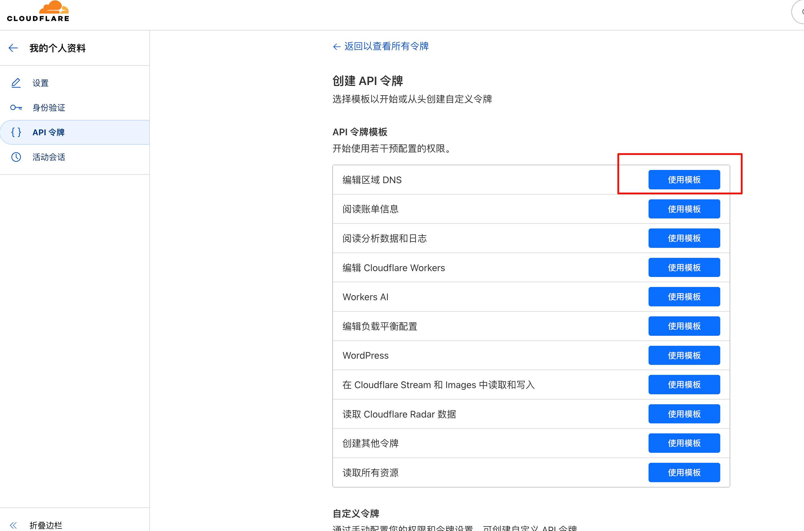
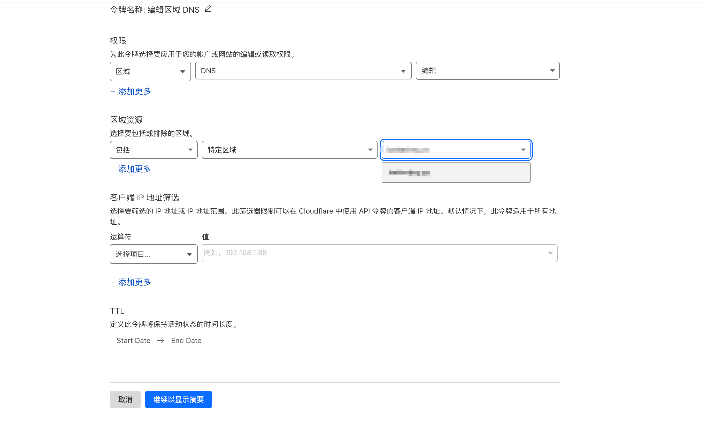
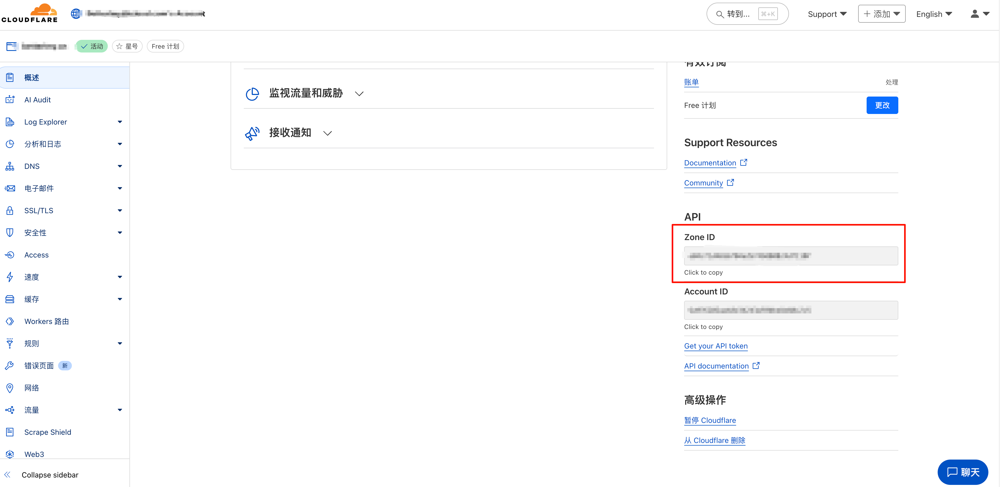

# Simple Cloudflare DDNS
[](https://github.com/betterlmy/simple-cloudflare-ddns/actions/workflows/release.yml)

[中文版本 / Chinese Version](README_CN.md)

A minimal Cloudflare Dynamic DNS client written in Go. No dependencies, single binary, configured entirely via environment variables.

**How it works**: Detect public IP → Compare with Cloudflare DNS → Update if changed

## Features

- Auto-selects the fastest IP detection service (icanhazip / ifconfig.co / ipify)
- Remembers the last successful service to minimize latency
- Only calls Cloudflare API when IP actually changes
- IPv4 (`A`) and IPv6 (`AAAA`) support
- Single-run mode for cron jobs

## Requirements

- Go 1.18+ (or use Docker)
- Access to Cloudflare API

## Configuration

All configuration is done via environment variables:

| Variable            | Required | Description                                                        |
| ------------------- | -------- | ------------------------------------------------------------------ |
| `CF_API_TOKEN`      | ✅        | Cloudflare API token (DNS edit permission)                         |
| `CF_ZONE_ID`        | ✅        | Cloudflare Zone ID                                                 |
| `CF_RECORD_NAME`    | ✅        | DNS record to update, e.g. `home.example.com`                      |
| `CF_RECORD_TYPE`    | ✅        | `A` (IPv4) or `AAAA` (IPv6)                                        |
| `CF_CHECK_INTERVAL` | —        | Check interval in seconds (default: `300`)                         |
| `CF_TTL`            | —        | DNS TTL in seconds (default: inherits existing record)             |
| `CF_PROXIED`        | —        | `true` or `false` (default: inherits existing record)              |
| `CF_IP_URLS`        | —        | Comma-separated IP detection service URLs (default: built-in list) |

## Quick Start

### Run directly

```bash
export CF_API_TOKEN=your-token
export CF_ZONE_ID=your-zone-id
export CF_RECORD_NAME=home.example.com
export CF_RECORD_TYPE=A

go run main.go
```

### Compile and run

```bash
go build -o scfddns .
./scfddns
```

### Run once (for cron)

```bash
./scfddns -once
```

## Docker

> If using a proxy, add `*.ipify.org`, `ifconfig.co`, `*.icanhazip.com` to your bypass list.

### Docker run

```bash
docker run -d \
  --name cloudflare-ddns \
  --restart unless-stopped \
  -e CF_API_TOKEN=your-token \
  -e CF_ZONE_ID=your-zone-id \
  -e CF_RECORD_NAME=home.example.com \
  -e CF_RECORD_TYPE=A \
  betterlmy/simple-cloudflare-ddns:latest
```

### Docker Compose

Create a `.env` file:
```env
CF_API_TOKEN=your-token
CF_ZONE_ID=your-zone-id
CF_RECORD_NAME=home.example.com
CF_RECORD_TYPE=A
```

Then run:
```bash
docker-compose up -d
```

### Build your own image

```bash
git clone https://github.com/betterlmy/simple-cloudflare-ddns.git
cd simple-cloudflare-ddns
docker build -t simple-cloudflare-ddns:latest .
```

### Docker image features
- Runs as non-root user
- Multi-arch: AMD64 and ARM64
- Alpine-based (~20MB)

## Command Line Arguments

| Flag    | Description                           |
| ------- | ------------------------------------- |
| `-once` | Run once and exit (suitable for cron) |

## How to Get Cloudflare Credentials

### API Token
1. Go to [Cloudflare API Tokens](https://dash.cloudflare.com/profile/api-tokens)
2. Click "Create Token" → "Edit zone DNS" → "Use template"
   
3. Set permissions: `Zone:DNS:Edit`, select your zone
   
4. Copy the generated token

### Zone ID
1. Go to [Cloudflare Dashboard](https://dash.cloudflare.com/)
2. Select your domain
3. Find "Zone ID" in the bottom-right of the Overview page
   

## FAQ

<details>
<summary><strong>Can't get public IP?</strong></summary>

- The program tries multiple services automatically
- If all fail, check your network connection or proxy bypass list
- Restart the program to retry
</details>

<details>
<summary><strong>DNS update not taking effect?</strong></summary>

- Verify `CF_ZONE_ID`, `CF_RECORD_NAME`, and `CF_RECORD_TYPE` are correct
- Check that the API token has DNS edit permission
- Make sure there's no conflicting record of a different type in Cloudflare
</details>

<details>
<summary><strong>Updates too frequent?</strong></summary>

- Increase `CF_CHECK_INTERVAL` (recommended: 300–600 seconds for home users)
</details>

## License

MIT License

---
<div align="center">
⭐ If you find it useful, please give a Star!
</div>
