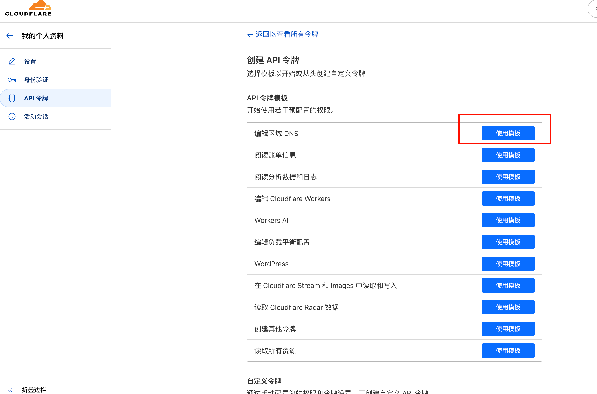

# 🌟 Simple Cloudflare DDNS

> 🎯 **Minimalist Design** | ⚡ **Ready to Use** | 🔧 **Zero Complex Configuration**

[中文版本 / Chinese Version](README_CN.md)

A **super simple** Cloudflare Dynamic DNS client! With just one configuration file and one command, you can keep your domain name always pointing to the correct IP address.

## 🔧 How It Works - Simple and Clear

Detect Public IP → Smart Comparison → Update DNS → Done

## 🚀 Core Features - Simplicity to the Extreme
- 🎯 **Smart IP Detection**: Automatically selects the best service (ipify/icanhazip/ifconfig)
- ⏰ **Scheduled Auto-Update**: Customizable check intervals, fully automated
- 🧠 **Service Memory**: Intelligently remembers the last used service
- 🎨 **Elegant Design**: Only updates DNS when IP actually changes
- 📦 **Out-of-the-Box**: No complex configuration needed, clear and easy structure

## 🛠️ Runtime Environment

> **True Simplicity**: Only requires Go environment, or even without!

- **Go 1.18+** (Go 1.22 recommended)
- Network environment with access to Cloudflare API
- **Supported Platforms**: Windows / macOS / Linux / Any platform that can install Go

## ⚡ 3-Minute Quick Start

### Step 1: Prepare Configuration File
```bash
# Copy example configuration
cp config_demo.json config.json
```

Edit `config.json`, just fill in these essential fields:
```json
{
  "api_token": "your-cloudflare-api-token",
  "zone_id": "your-zone-id", 
  "record_name": "home.example.com",
  "record_type": "A",
  "check_interval_seconds": 300
}
```

> 💡 **Configuration Explanation**:
> - `api_token`: Cloudflare API Token (requires DNS edit permission)
> - `zone_id`: Cloudflare Zone ID 
> - `record_name`: Complete domain name to update
> - `record_type`: `A` (IPv4) or `AAAA` (IPv6)
> - `check_interval_seconds`: Check interval (seconds)

### Step 2: Run

**Method 1: Direct Run**
```bash
go run main.go -config config.json
```

**Method 2: Compile and Run**
```bash
# Compile
go build -o myddns .

# Run
./myddns -config config.json
```

**Method 3: Docker Run (Recommended)**
```bash
# Pull from Docker Hub
docker pull betterlmy/simple-cloudflare-ddns:latest

# Run once
docker run --rm -v $(pwd)/config.json:/app/config.json betterlmy/simple-cloudflare-ddns:latest ./scfddns -config /app/config.json -once

# Run as daemon
docker run -d --name cloudflare-ddns --restart unless-stopped -v $(pwd)/config.json:/app/config.json betterlmy/simple-cloudflare-ddns:latest
```

**Method 4: Docker Compose (Easiest)**
```bash
# Create docker-compose.yml and run
docker-compose up -d
```

## 🎛️ Command Line Arguments - Simple and Flexible

| Parameter | Description | Example |
|-----------|-------------|---------|
| `-config` | Configuration file path | `-config /path/to/config.json` |
| `-once` | Run once and exit | `-once` (suitable for cron) |

## 🐳 Docker Deployment - Production Ready

### Quick Start with Docker

> Please Add `*.ipify.org,ifconfig.co,*.icanhazip.com` to your bypass proxy list if using a proxy.

```bash
# 1. Pull the image
docker pull betterlmy/simple-cloudflare-ddns:latest

# 2. Prepare your config.json file
# 3. Run
docker run -d \
  --name cloudflare-ddns \
  --restart unless-stopped \
  -v /path/to/your/config.json:/app/config.json:ro \
  betterlmy/simple-cloudflare-ddns:latest
```

### Docker Compose (Recommended)
Create `docker-compose.yml`:
```yaml
services:
  cloudflare-ddns:
    image: betterlmy/simple-cloudflare-ddns:latest
    container_name: cloudflare-ddns
    restart: unless-stopped
    volumes:
      - ./config.json:/app/config.json:ro
    environment:
      - TZ=UTC  # Set your timezone
```

Then run:
```bash
docker-compose up -d
```

### Build Your Own Image
```bash
# Clone the repository
git clone https://github.com/betterlmy/simple-cloudflare-ddns.git
cd simple-cloudflare-ddns

# Build the image
docker build -t simple-cloudflare-ddns:latest .

# Run your custom build
docker run -d \
  --name cloudflare-ddns \
  --restart unless-stopped \
  -v $(pwd)/config.json:/app/config.json:ro \
  simple-cloudflare-ddns:latest
```

### Docker Features
- 🔒 **Security**: Runs as non-root user
- 📦 **Minimal**: Only ~19.8MB image size
- 🚀 **Multi-arch**: Supports AMD64 and ARM64
- ⚡ **Fast**: Alpine-based for quick startup
- 🔧 **Configurable**: Environment variables support

## 🔐 Security & Permissions - Simple and Secure

> **Principle of Least Privilege**: Only request necessary permissions

### Create Minimal Permission Cloudflare API Token:
1. Go to [Cloudflare API Tokens](https://dash.cloudflare.com/profile/api-tokens)
2. Click "Create Token" → "Edit zone DNS" → "Use template"

3. Configure permissions:
   - **Permissions**: `Zone:DNS:Edit`
   - **Zone Resources**: Select your target domain

4. Create and copy the generated Token

### Security Tips:
- Do not commit `config.json` to code repository
- When Token is leaked, immediately revoke and regenerate in Cloudflare dashboard

## 🌍 How to Get Zone ID:
1. Go to [Cloudflare Dashboard](https://dash.cloudflare.com/)
2. Select your domain
3. Find "Zone ID" in the bottom right corner of the "Overview" page


## ❓ FAQ - Simple Answers

<details>
<summary><strong>Can't get public IP?</strong></summary>

- ✅ The program will automatically try multiple services
- 🔍 When all fail, check network connection or proxy settings
- 💡 Usually a network issue, restart the program to resolve
</details>

<details>
<summary><strong>DNS update not taking effect?</strong></summary>

- ✅ Confirm `zone_id`, `record_name`, `record_type` are filled correctly
- 🔑 Check if API Token permissions are sufficient
- 🔍 Check if Cloudflare console has records with same name but different type
</details>

<details>
<summary><strong>Updates too frequent?</strong></summary>

- 🔧 Appropriately increase `check_interval_seconds` value
- 🌐 Check if network environment frequently changes exit IP
- 💡 Recommend 300-600 second intervals for home users
</details>

## 📄 License

MIT License - Simple and free, use as you wish 🎉

---
<div align="center">
⭐ If you find it useful, please give a Star to support～
</div>
