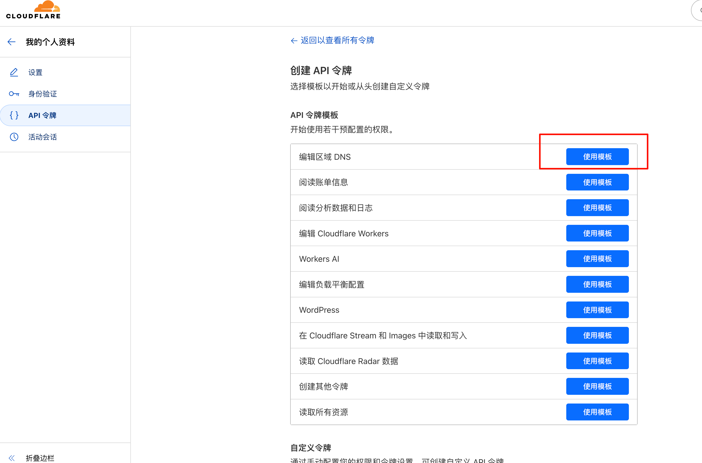
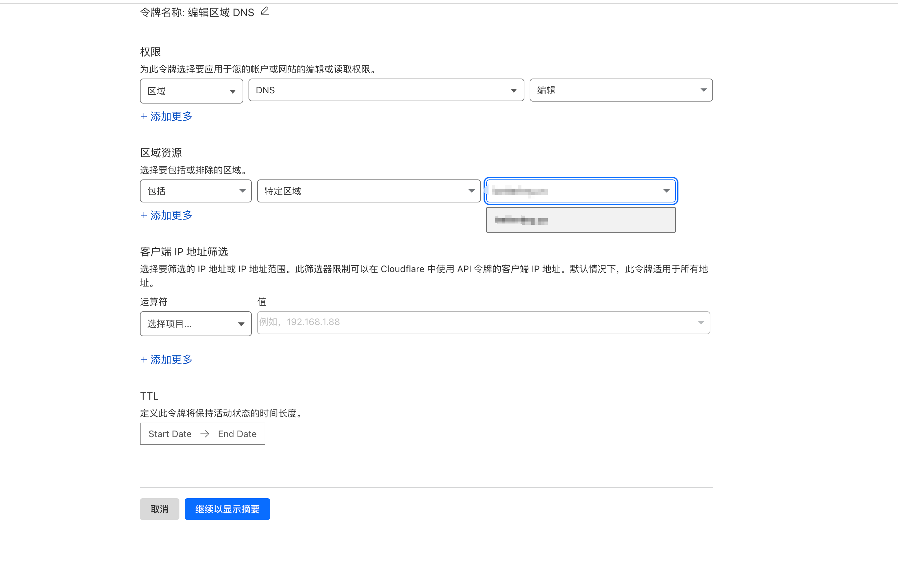
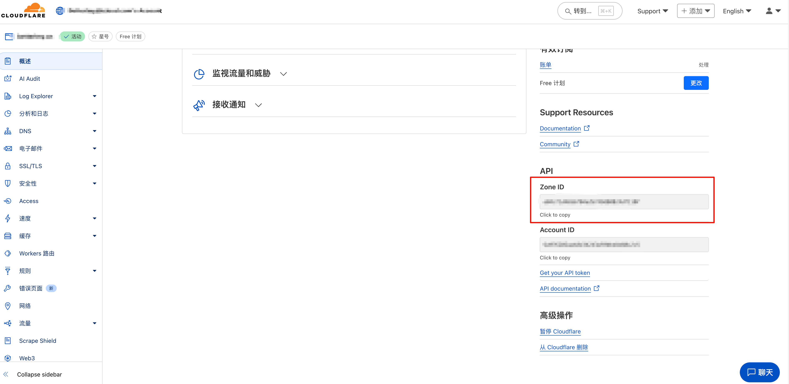

# 🌟 Simple Cloudflare DDNS

> 🎯 **极简设计** | ⚡ **即开即用** | 🔧 **零复杂配置**

[English Version / 英文版本](README.md)

一个**超级简单**的 Cloudflare 动态 DNS 客户端！仅需一个配置文件，一条命令，就能让你的域名始终指向正确的 IP 地址。

## 🔧 工作原理 - 简单明了

 检测公网 IP → 智能对比 → 更新 DNS → 完成

## 🚀 核心功能 - 简单到极致
- 🎯 **智能 IP 检测**：自动选择最佳服务（ipify/icanhazip/ifconfig）
- ⏰ **定时自动更新**：可自定义检查间隔，完全自动化
- 🧠 **服务记忆**：智能记录上次服务
- 🎨 **优雅设计**：仅在 IP 真正变化时才更新 DNS
- 📦 **开箱即用**：无需复杂配置，结构清晰易懂


## 🛠️ 运行环境

>  **真正的简单**：只需要 Go 环境，甚至可以不要！

-  **Go 1.18+** （推荐使用 Go 1.22）
-  能访问 Cloudflare API 的网络环境
-  **支持平台**：Windows / macOS / Linux / 任何可以安装 Go 的平台

## ⚡ 3分钟快速开始

### 第 1 步：准备配置文件 
```bash
# 复制示例配置
cp config_demo.json config.json
```

编辑 `config.json`，只需填写这几个必要字段：
```json
{
  "api_token": "你的-cloudflare-api-token",
  "zone_id": "你的-zone-id", 
  "record_name": "home.example.com",
  "record_type": "A",
  "check_interval_seconds": 300
}
```

> 💡 **配置说明**：
> -  `api_token`：Cloudflare API Token（需要 DNS 编辑权限）
> -  `zone_id`：Cloudflare Zone ID 
> -  `record_name`：要更新的完整域名
> -  `record_type`：`A`（IPv4）或 `AAAA`（IPv6）
> -  `check_interval_seconds`：检查间隔（秒）

### 第 2 步：运行 

**方式 1：直接运行**
```bash
go run main.go -config config.json
```

**方式 2：编译运行**
```bash
# 编译
go build -o myddns .

# 运行
./myddns -config config.json
```

**方式 3：Docker 运行（推荐）**
```bash
# 从 Docker Hub 拉取镜像
docker pull betterlmy/simple-cloudflare-ddns:latest

# 运行一次
docker run --rm -v $(pwd)/config.json:/app/config.json betterlmy/simple-cloudflare-ddns:latest ./scfddns -config /app/config.json -once

# 后台运行
docker run -d --name cloudflare-ddns --restart unless-stopped -v $(pwd)/config.json:/app/config.json betterlmy/simple-cloudflare-ddns:latest
```

**方式 4：Docker Compose（最简单）**
```bash
# 创建 docker-compose.yml 并运行
docker-compose up -d
```


## 🎛️ 命令行参数 - 简单灵活

| 参数 | 说明 | 示例 |
|------|------|------|
| `-config` | 配置文件路径 | `-config /path/to/config.json` |
| `-once` | 运行一次后退出 | `-once`（适合 cron） |

## 🐳 Docker 部署 - 生产就绪

> 请添加`*.ipify.org,ifconfig.co,*.icanhazip.com`到你的代理绕过列表中（如果使用代理）。

### Docker 快速开始
```bash
# 1. 拉取镜像
docker pull betterlmy/simple-cloudflare-ddns:latest

# 2. 准备你的 config.json 文件
# 3. 运行
docker run -d \
  --name cloudflare-ddns \
  --restart unless-stopped \
  -v /path/to/your/config.json:/app/config.json:ro \
  betterlmy/simple-cloudflare-ddns:latest
```

### Docker Compose（推荐）
创建 `docker-compose.yml`：
```yaml
services:
  cloudflare-ddns:
    image: betterlmy/simple-cloudflare-ddns:latest
    container_name: cloudflare-ddns
    restart: unless-stopped
    volumes:
      - ./config.json:/app/config.json:ro
    environment:
      - TZ=Asia/Shanghai  # 设置时区
```

然后运行：
```bash
docker-compose up -d
```

### 构建自己的镜像
```bash
# 克隆仓库
git clone https://github.com/betterlmy/simple-cloudflare-ddns.git
cd simple-cloudflare-ddns

# 构建镜像
docker build -t simple-cloudflare-ddns:latest .

# 运行自定义构建
docker run -d \
  --name cloudflare-ddns \
  --restart unless-stopped \
  -v $(pwd)/config.json:/app/config.json:ro \
  simple-cloudflare-ddns:latest
```

### Docker 特性
- 🔒 **安全性**：以非 root 用户运行
- 📦 **精简**：镜像大小仅约 19.8MB
- 🚀 **多架构**：支持 AMD64 和 ARM64
- ⚡ **快速**：基于 Alpine 快速启动
- 🔧 **可配置**：支持环境变量配置


## 🔐 安全 & 权限 - 简单安全

> **最小权限原则**：只申请必需的权限

### 创建最小权限的 Cloudflare API Token：
1.  前往 [Cloudflare API Tokens](https://dash.cloudflare.com/profile/api-tokens)
2.  点击 "Create Token" → "编辑区域 DNS" → "使用模板"

3.  配置权限：
   - **权限**：`Zone:DNS:编辑`
   - **资源**：选择你的目标域名

4.  创建并复制生成的 Token

### 安全提示：
- 请勿将 `config.json` 提交到代码仓库
- Token 泄露时，立即在 Cloudflare 后台撤销并重新生成

## 🌍 Zone ID 获取方法：
1.  前往 [Cloudflare Dashboard](https://dash.cloudflare.com/)
2.  选择你的域名
3.  在 "Overview" 页面的右下角中找到 "Zone ID"

## ❓ 常见问题 - 简单解答

<details>
<summary><strong>无法获取公网 IP？</strong></summary>

- ✅ 程序会自动尝试多个服务
- 🔍 全部失败时，检查网络连接或代理设置
- 💡 通常是网络问题，重启程序即可解决
</details>

<details>
<summary><strong>DNS 更新不生效？</strong></summary>

- ✅ 确认 `zone_id`、`record_name`、`record_type` 填写正确
- 🔑 检查 API Token 权限是否充足
- 🔍 Cloudflare 控制台是否有同名但不同类型的记录
</details>

<details>
<summary><strong>更新太频繁？</strong></summary>

- 🔧 适当增大 `check_interval_seconds` 值
- 🌐 检查网络环境是否频繁更换出口 IP
- 💡 建议家庭用户设置 300-600 秒间隔
</details>


## 📄 许可证

MIT License - 简单自由，随意使用 🎉

---
<div align="center">
⭐ 如果觉得好用，请给个 Star 支持一下～
</div>
